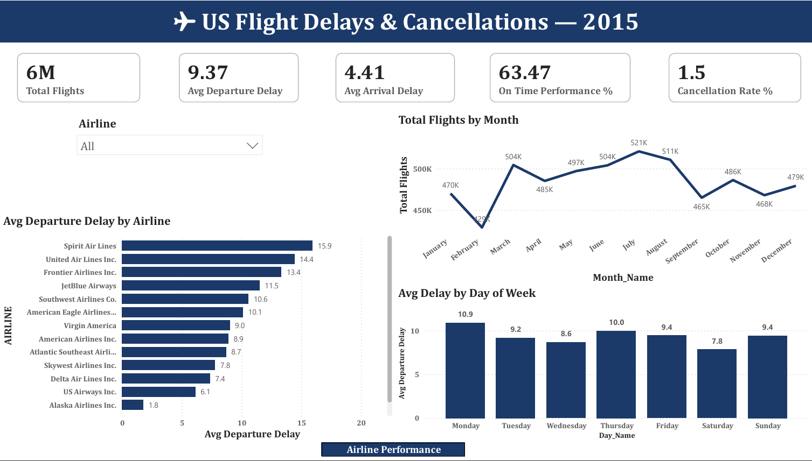

# US Flight Delays & Cancellations — Power BI Dashboard

## About This Project

After completing the SQL analysis of 5.8 million US flight records I wanted to present the findings in a way that anyone could understand without reading a single query. Business stakeholders and operations teams need visual answers not SQL code.

I built this interactive dashboard in Power BI connecting directly to the findings from my SQL analysis — turning numbers into stories that decision makers can act on immediately.

## Dashboard Pages

**Page 1 — Overview**
High level KPIs — total flights, average departure delay, on-time performance and cancellation rate. Monthly flight volume trends and delay patterns by day of week with airline filter.

**Page 2 — Airline Performance**
Complete airline scorecard with color coded performance table. On-time performance and cancellation rate ranked across all 14 airlines.

**Page 3 — Airport & Route Analysis**
Top 10 busiest airports and routes by volume. Most delayed routes with interactive airline filter to drill down by carrier.

**Page 4 — Delay & Cancellation Analysis**
Delay cause breakdown by airline showing weather, airline fault and late aircraft contributions. Monthly delay trends and cancellation reason distribution.

**Page 5 — Airline Deep Dive**
Single airline analysis with full KPIs, delay cause breakdown and monthly performance trends for any selected airline.

## Key Visuals Used

- KPI cards for instant headline metrics
- Color coded scorecard table for quick comparison
- Bar charts for airline and route rankings
- Donut chart for cancellation reason breakdown
- Line chart for monthly delay trends
- Interactive slicers for airline filtering

## Key Findings Visualized

- United Airlines worst performer at 50% on-time 
  rate vs Alaska Airlines best at 75%
- Weather causes 54% of cancellations but airline 
  fault causes 28% — fully preventable
- June and July worst months for delays
- ATL (Atlanta) busiest airport handling 350K flights
- SFO → LAX busiest route with 13,700 flights

## Tools Used
- Power BI Desktop
- Data source: MySQL database
- 5,819,079 flight records | 2015

## Related Project
🔍 [SQL Analysis Repository](https://github.com/gautamgpt311/flight-delays-sql-analysis)
